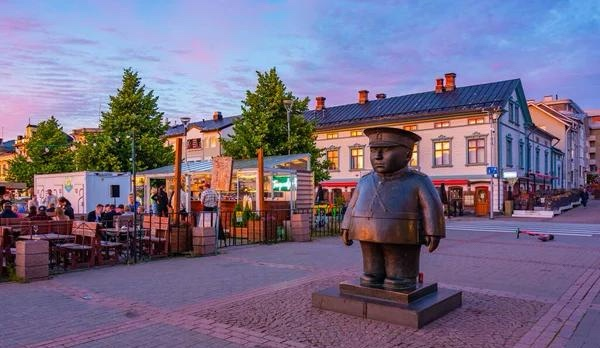

<!-- ---
title: 17th International Workshop on the Algorithmic Foundations of Robotics
--- -->

# 17th International Workshop on the Algorithmic Foundations of Robotics (WAFR)

The 17th International Workshop on the Algorithmic Foundations of Robotics (WAFR) will be held on June 15 to June 17, 2026 in Oulu, Finland.

# Important dates

- Paper submission deadline: January 15, 2026
- Notification of acceptance: March 15, 2026
- Preliminary paper deadline: May 15, 2026
- Conference attendance: June 15-17, 2026

# Call for papers

The Workshop on the Algorithmic Foundations of Robotics (WAFR) is a biannual multi-disciplinary single-track conference of international researchers presenting the latest advances on algorithmic problems in robotics.
Since its inception in 1994, WAFR has established a reputation as a premier venue for presenting algorithmic work related to robotics.

The focus of WAFR is on the design and analysis of robot algorithms from both theoretical and practical angles.
These algorithms process inputs from noisy sensors, build geometric and physical models of the world, plan high-level and low-level actions at different time horizons, and execute these actions on actuators with limited precision.
The design and analysis of robot algorithms raise a unique combination of questions from many fields, including but not limited to:
- Algorithmic approaches to human-robot interaction
- Computational geometry and topology
- Control theory and optimization
- Distributed and parallel methods
- Decision theory and game theory
- Geometrical and physical modeling
- Machine learning (including supervised and unsupervised learning, reinforcement learning, representation learning, and imitation learning)
- Planning and reasoning under uncertainty
- Probabilistic and sampling-based algorithms
- Sensing and perception
- Task and motion planning
- Theoretical computer science

In addition to these topics, we also encourage papers on applications of robot algorithms to important or new domains, including those beyond the traditional scope of robotics, such as:
- Assistive and service robotics
- Brain-controlled robots
- Computational biology
- Computer animation, graphics and animation, VR/AR
- Legged locomotion
- Manufacturing and automation
- Multi-agent systems
- Sensor networks and IoT devices
- Surgical robots, intelligent prosthetics, rehabilitation robots
- Transportation networks and systems

The conference proceedings will be published in the [Springer Proceedings in Advanced Robotics (SPAR)](https://www.springer.com/series/15556) series and selected papers will be invited for publication in special issues of relevant journals.

# Past editions of WAFR

- [2024, Chicago, USA](https://www.algorithmic-robotics.org/authors.php)
- [2022, College Park, USA](https://wafr2022.github.io/)
- [2020, virtual](http://robotics.cs.rutgers.edu/wafr2020/)
- [2018, Mérida, México](https://parasollab.web.illinois.edu/events/wafr/wafr2018/)
- [2016, San Francisco, USA](https://parasollab.web.illinois.edu/events/wafr/wafr2016/)
- [2014, Istanbul, Turkey](http://robot.cmpe.boun.edu.tr/wafr2014/)
- [2012, Cambridge, MA, USA](http://ares.lids.mit.edu/wafr/)
- [2010, Singapore](https://parasollab.web.illinois.edu/events/wafr/wafr2010/)
- [2008, Guanajuato, México](https://parasollab.web.illinois.edu/events/wafr/wafr2008/)
- [2006, New York City, USA](https://parasollab.web.illinois.edu/events/wafr/wafr2006/)
- [2004, Zeist, The Netherlands](https://parasollab.web.illinois.edu/events/wafr/wafr2004)
- [2002, Nice, France](https://parasollab.web.illinois.edu/events/wafr/wafr2002/)
- [2000, Hanover, USA](https://parasollab.web.illinois.edu/events/wafr/wafr2000/)
- [1998, Houston, USA](https://parasollab.web.illinois.edu/events/wafr/wafr1998/)
- [1996, Toulouse, France](https://parasollab.web.illinois.edu/events/wafr/wafr1996/)
- 1994, Stanford, USA

# Contacts

- E-mail: <a href="mailto:wafr2026@gmail.com">wafr2026@gmail.com</a>
