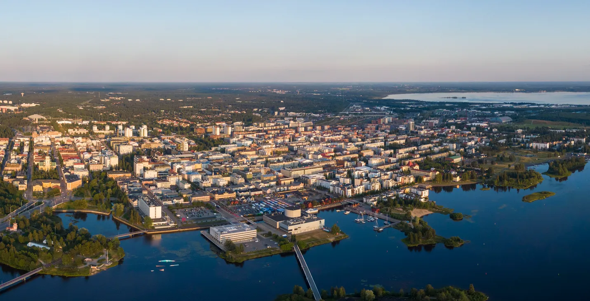

The 17th International Workshop on the Algorithmic Foundations of Robotics (WAFR) will be held on June 15 to June 17, 2026 in Oulu, Finland

## News and updates

## Important Dates

- Paper submission deadline: January 15, 2026
- Notification of acceptance: March 15, 2026
- Preliminary paper deadline: May 15, 2026
- Conference attendance: June 15-17, 2026

## Contacts

- E-mail: <a href="mailto:wafr2026@gmail.com">wafr2026@gmail.com</a>
