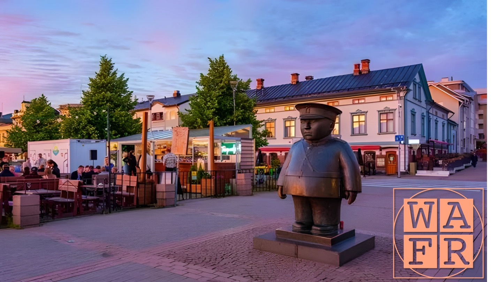

<!-- ---
title: 17th International Workshop on the Algorithmic Foundations of Robotics
--- -->

# 17th International Workshop on the Algorithmic Foundations of Robotics (WAFR)

The 17th International Workshop on the Algorithmic Foundations of Robotics (WAFR) will be held on June 15 to June 17, 2026 in Oulu, Finland.

# Important dates

- Paper submission deadline: January 15, 2026
- Notification of acceptance: March 15, 2026
- Preliminary paper deadline: May 15, 2026
- Conference attendance: June 15-17, 2026

# Call for papers

The Workshop on the Algorithmic Foundations of Robotics (WAFR) is a biannual multi-disciplinary single-track conference of international researchers presenting the latest advances on algorithmic problems in robotics.
Since its inception in 1994, WAFR has established a reputation as a premier venue for presenting algorithmic work related to robotics.

The focus of WAFR is on the design and analysis of robot algorithms, from both theoretical and practical angles.
This focus gives rise to challenging research questions that span many areas of robotics and intersect with neighboring disciplines.

We welcome contributions from all subfields of robotics involving algorithmic innovation, including (but not limited to): motion planning, sensing, perception, human-robot interaction, robot learning, locomotion, and manipulation.

We also encourage submissions that draw from neighboring fields such as computational geometry, computational topology, control theory, numerical optimization, decision theory, game theory, artificial intelligence, theory of computation, distributed and parallel algorithms.

Finally, we invite papers that explore the application of robotic algorithms in new or impactful domains, even beyond the traditional scope of robotics.
Examples include computational biology, computer animation, transportation systems, manufacturing, multi-agent systems, sensor networks, IoT devices, and intelligent prosthetics.

The conference proceedings will be published in the [Springer Proceedings in Advanced Robotics (SPAR)](https://www.springer.com/series/15556) series and selected papers will be invited for publication in special issues of relevant journals.

# Past editions of WAFR

- [2024, Chicago, USA](https://www.algorithmic-robotics.org/authors.php)
- [2022, College Park, USA](https://wafr2022.github.io/)
- [2020, virtual](http://robotics.cs.rutgers.edu/wafr2020/)
- [2018, Mérida, México](https://parasollab.web.illinois.edu/events/wafr/wafr2018/)
- [2016, San Francisco, USA](https://parasollab.web.illinois.edu/events/wafr/wafr2016/)
- [2014, Istanbul, Turkey](http://robot.cmpe.boun.edu.tr/wafr2014/)
- [2012, Cambridge, MA, USA](http://ares.lids.mit.edu/wafr/)
- [2010, Singapore](https://parasollab.web.illinois.edu/events/wafr/wafr2010/)
- [2008, Guanajuato, México](https://parasollab.web.illinois.edu/events/wafr/wafr2008/)
- [2006, New York City, USA](https://parasollab.web.illinois.edu/events/wafr/wafr2006/)
- [2004, Zeist, The Netherlands](https://parasollab.web.illinois.edu/events/wafr/wafr2004)
- [2002, Nice, France](https://parasollab.web.illinois.edu/events/wafr/wafr2002/)
- [2000, Hanover, USA](https://parasollab.web.illinois.edu/events/wafr/wafr2000/)
- [1998, Houston, USA](https://parasollab.web.illinois.edu/events/wafr/wafr1998/)
- [1996, Toulouse, France](https://parasollab.web.illinois.edu/events/wafr/wafr1996/)
- 1994, Stanford, USA

# Contacts

- E-mail: <a href="mailto:wafr2026@gmail.com">wafr2026@gmail.com</a>
