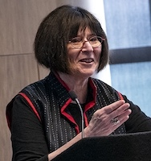
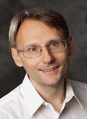

<table border="1" style="border-collapse: collapse; width: 100%;">
  <tr>
    <th style="width: 20%;">Time</th>
    <th>Event</th>
  </tr>
  <tr><td colspan="2" style="text-align: center; font-weight: bold;">Sunday, June 14</td></tr>
  <tr><td>8:00-21:00</td><td>Day trip to Arctic Circle</td></tr>
  <!-- <tr><td>19:00-21:00</td><td>Informal meetup</td></tr> -->
  <tr><td colspan="2" style="text-align: center; font-weight: bold;">Monday, June 15</td></tr>
  <tr><td>8:00-9:00</td><td>Breakfast</td></tr>
  <tr><td>9:00-9:15</td><td>Opening welcome</td></tr>
  <tr><td>9:15-10:09</td><td><a href="/s1/">Paper Session I</a></td></tr><!--3 papers-->
  <tr><td>10:10-10:30</td><td>Break</td></tr>
  <tr><td>10:30-11:30</td><td>Keynote talk by <a href="https://www.cs.cmu.edu/~lblum/">Lenore Blum</a>:  <i>AI Consciousness is Inevitable: A Theoretical Computer Science Perspective</i></td></tr>
  <tr><td>11:30-11:45</td><td>Break</td></tr>
  <tr><td>11:45-12:57</td><td><a href="/s2/">Paper Session II</a></td></tr><!-- 4 papers-->
  <tr><td>13:00-14:00</td><td>Lunch</td></tr>
  <tr><td>14:00-15:30</td><td><a href="/s3/">Paper Session III</a></td></tr><!-- (5 papers)-->
  <tr><td>15:30-16:00</td><td>Break</td></tr>
  <tr><td>16:30-17:30</td><td><a href="/s4/">Paper Session IV</a></td></tr><!-- (5 papers)-->
  <tr><td>19:00-20:30</td><td>The City of Oulu's Welcome Reception at the <a href="https://www.ouka.fi/kaupungintalo">City Hall</a></td></tr>
  <tr><td colspan="2" style="text-align: center; font-weight: bold;">Tuesday, June 16</td></tr>
  <tr><td>8:00-9:00</td><td>Breakfast</td></tr>
  <tr><td>9:00-10:12</td><td><a href="/s5/">Paper Session V</a></td></tr><!--(4 papers)-->
  <tr><td>10:15-10:30</td><td>Break</td></tr>
  <tr><td>10:30-11:30</td><td>Keynote talk by <a href="https://idm-lab.org">Sven Koenig</a>:  <i>Advances in Heuristic Search and Their Applications in Robotics</i></td></tr>
  <tr><td>11:30-11:45</td><td>Break</td></tr>
  <!--<tr><td>11:15-12:30</td><td>Session on open problems in robotics</td></tr>-->
  <tr><td>11:45-12:57</td><td><a href="/s6/">Paper Session VI</a></td></tr><!--(4 papers)-->
  <tr><td>13:00-14:00</td><td>Lunch</td></tr>
  <tr><td>14:00-15:12</td><td><a href="/s7/">Paper Session VII</a></td></tr><!--(4 papers)-->
  <tr><td>15:30-17:30</td><td><a href="/bof/">Birds of a Feather</a></td></tr>
  <!--<tr><td>15:00-15:30</td><td>Break</td></tr>
  <tr><td>15:30-17:00</td><td>Session VII: Session title and speakers</td></tr>-->
  <tr><td>19:00-22:00</td><td>WAFR Dinner at <a href="https://maikkulankartano.fi/"> Maikkula Mansion</a></td></tr>
  <tr><td colspan="2" style="text-align: center; font-weight: bold;">Wednesday, June 17</td></tr>
  <tr><td>8:00-9:00</td><td>Breakfast</td></tr>
  <tr><td>9:00-10:12</td><td><a href="/s8/">Paper Session VIII</a></td></tr><!--(4 papers)-->
  <tr><td>10:15-10:30</td><td>Break</td></tr>
  <tr><td>10:30-11:30</td><td>Keynote talk by <a href="https://www.user.tu-berlin.de/mtoussai/">Marc Toussaint</a>:  <i>Towards Diverse Solvers</i></td></tr>
  <tr><td>11:30-11:45</td><td>Break</td></tr>
  <tr><td>11:45-13:00</td><td>Session on Open Problems in Robotics</td></tr>
  <tr><td>13:00-14:00</td><td>Lunch</td></tr>
  <tr><td>14:00-15:30</td><td><a href="/s9/">Paper Session IX</a></td></tr><!--(5 papers)-->
  <tr><td>15:30-16:00</td><td>Break</td></tr>
  <tr><td>16:00-17:12</td><td><a href="/s10/">Paper Session X</a></td></tr><!--(4 papers)-->
  <tr><td>17:15-17:30</td><td>Closing</td></tr>
</table>

## Keynote speakers

### <a href="https://www.cs.cmu.edu/~lblum/">Lenore Blum</a>

**Title:**
*AI Consciousness is Inevitable: A Theoretical Computer Science Perspective*

**Abstract:**
We look at consciousness through the lens of Theoretical Computer Science, a branch of mathematics that studies computation under resource limitations, distinguishing functions that are efficiently computable from those that are not.
From this perspective, we are developing a formal machine model for consciousness.
We are inspired by Alan Turing’s simple yet powerful model of computation and Bernard Baars’ theater model of
consciousness.
Though extremely simple, the model (1) aligns at a high level with many of the major scientific theories of human and animal consciousness, (2) provides explanations at a high level for many phenomena associated with consciousness, (3) gives insight into how a machine can have subjective consciousness, and (4) is clearly buildable.
This combination supports our claim that machine consciousness is not only plausible but inevitable.
See: [https://arxiv.org/pdf/2403.17101](https://arxiv.org/pdf/2403.17101)
This is joint work with Manuel Blum and Avrim Blum.

**Bio:**
Lenore Blum (PhD, MIT; Distinguished Career Professor of Computer Science, Emerita, CMU) is a mathematician and theoretical computer scientist.
She is a Fellow of the American Association for the Advancement of Science, the American Mathematical Society, the Association for Women in Mathematics, and the American Academy of Arts and Science.
Lenore is the inaugural and current president of the international Association for Mathematical Consciousness Science (AMCS).

### <a href="https://idm-lab.org">Sven Koenig</a>

**Title:**
*Advances in Heuristic Search and Their Applications in Robotics*

**Abstract:**
AI researchers and others have made significant progress in heuristic search algorithms over the years, for example, in incremental search, any-angle search, hierarchical search, multi-objective search, and multi-agent pathfinding.
In this talk, I will provide an overview of some of these approaches, both from my research group and others.
Then, I will discuss whether machine learning has made heuristic search obsolete.
Finally, I will explain how heuristic search approaches from train scheduling, turn-by-turn navigation for cars, video games, and other applications can be helpful to know about in mobile robotics.

**Bio:**
Sven Koenig is a fellow of IEEE, ACM, AAAI, and AAAS whose research focuses on AI decision-making techniques that enable single robots and multi-robot systems to act intelligently in real-time.

### <a href="https://www.user.tu-berlin.de/mtoussai/">Marc Toussaint</a>

**Title:**
*Towards Diverse Solvers*

**Abstract:**
Optimization is a powerful tool across fields, including robot planning and control, but also underlying ML and RL.
However, in certain cases we would like solvers to return a diversity of solutions rather than only a single optimal one -- e.g. to overcome or enumerate local optima or to guarantee a kind of completeness when combined with higher-level search.

In this talk I will discuss approaches towards diverse solvers, including existing methods in optimization, MCMC, RL, and robotics, and novel ideas to combine them.

**Bio:** TBD

