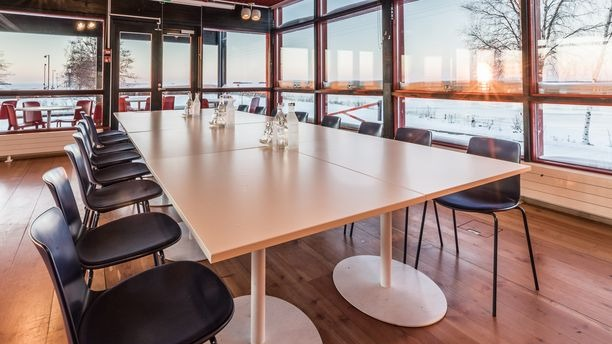

The conference will take place at [Ravintola Nallikari](http://ravintolanallikari.fi/) ([Nallikarinranta 15, 90510 Oulu, Finland](
https://maps.app.goo.gl/eqSEQHTdCogn9D5J7)).
A beautiful beachfront venue surrounded by forested nature trails, just 3 km from the city center.
An ideal setting for relaxed strolls and deep technical discussions!

<h2 style="color: darkblue;">Biking to the venue from the city center</h2>

A fleet of bicycles will be reserved for all the WAFR participants that are interested in reaching the venue by bike.
The bike ride from the city center is only 10 minute long.
It is isolated from car roads and is level ground the whole way.

<h2 style="color: darkblue;">Free shuttles from the city center</h2>

Free shuttles from the city center to the venue will be provided.

<h2 style="color: darkblue;">Coming to Oulu</h2>

The [Oulu Airport (OUL)](https://maps.app.goo.gl/4b3FGb4rcPUhoSYk7) is 15 minutes away from the city center, and is connected with public transport.
Multiple flights to Oulu Airport (OUL) depart from [Helsinki Airport (HEL)](https://maps.app.goo.gl/J4Q9wVBG9ZTPzKWN8) every day.

Alternatively, Oulu can be reached from Helsinki via train.

<h2 style="color: darkblue;">Accommodation</h2>

Accommodations are available right by the conference venue at the beach (see the options avaliable at [this link](https://nallikari.fi/en/accommodation/)).
Alternatively, we suggest the following hotels in the city center:
- [Radisson Blu](https://www.radissonhotels.com/en-us/hotels/radisson-blu-oulu)
- [Scandic](https://www.scandichotels.com/en/hotels/scandic-oulu-city)

<h2 style="color: darkblue;">Travel grants for students</h2>

TBD
